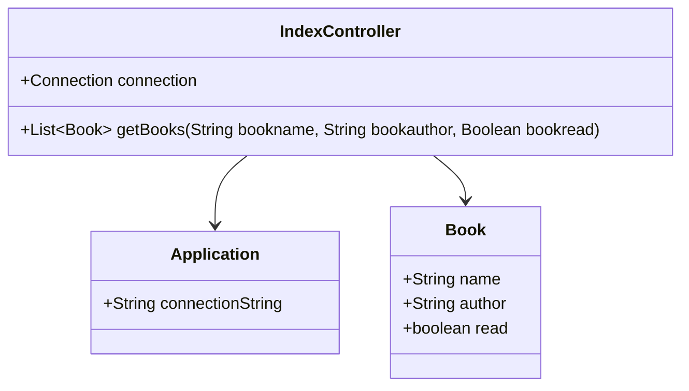

# Documentation of the file IndexController.java

## Introduction

This file is part of the `com.github.hackathon.advancedsecurityjava.Controllers` package. It defines a Spring Boot controller that handles HTTP GET requests for retrieving a list of books from a database.

## Description

The `IndexController` class is annotated with `@Controller`, indicating that it is a Spring MVC controller. It contains a method `getBooks` that handles GET requests to the root URL ("/"). The method interacts with a database to fetch a list of books based on optional query parameters such as name, author, and read status.

## Structure

The file structure includes:
- Package declaration
- Import statements
- Class declaration
- Private static variables
- Methods

## Dependencies

- Spring Framework (`@Controller`, `@GetMapping`, `@RequestParam`, `@ResponseBody`)
- Java SQL (`Connection`, `DriverManager`, `ResultSet`, `SQLException`, `Statement`)
- Custom classes (`Application`, `Book`)

## Imports

```java
import java.sql.Connection;
import java.sql.DriverManager;
import java.sql.ResultSet;
import java.sql.SQLException;
import java.sql.Statement;
import java.util.ArrayList;
import java.util.List;

import com.github.hackathon.advancedsecurityjava.Application;
import com.github.hackathon.advancedsecurityjava.Models.Book;

import org.springframework.stereotype.Controller;
import org.springframework.web.bind.annotation.GetMapping;
import org.springframework.web.bind.annotation.RequestParam;
import org.springframework.web.bind.annotation.ResponseBody;
```

## Variables

- `private static Connection connection`: A static variable to hold the database connection.

## Methods

### `getBooks`

```java
@GetMapping("/")
@ResponseBody
public List<Book> getBooks(@RequestParam(name = "name", required = false) String bookname,
    @RequestParam(name = "author", required = false) String bookauthor,
    @RequestParam(name = "read", required = false) Boolean bookread) {
```

#### Description

This method handles HTTP GET requests to the root URL ("/"). It fetches a list of books from the database based on the provided optional query parameters: `name`, `author`, and `read`.

#### Parameters

- `@RequestParam(name = "name", required = false) String bookname`: Optional query parameter to filter books by name.
- `@RequestParam(name = "author", required = false) String bookauthor`: Optional query parameter to filter books by author.
- `@RequestParam(name = "read", required = false) Boolean bookread`: Optional query parameter to filter books by their read status.

#### Returns

- `List<Book>`: A list of `Book` objects that match the query parameters.

## Example

To use this file, you would typically start the Spring Boot application and make an HTTP GET request to the root URL with optional query parameters.

Example GET Requests:

- `GET /`: Fetch all books.
- `GET /?name=Harry`: Fetch books with names containing "Harry".
- `GET /?author=Rowling`: Fetch books with authors containing "Rowling".
- `GET /?read=true`: Fetch books that have been read.

## Dependency Diagram



## Notes

- The database connection is initialized within the `getBooks` method and closed in the `finally` block to ensure resources are released.
- The SQL queries are constructed based on the presence of query parameters, which could lead to SQL injection vulnerabilities. Use prepared statements for better security.

## Vulnerabilities

- **SQL Injection**: The current implementation constructs SQL queries using string concatenation, making it vulnerable to SQL injection attacks. It is recommended to use prepared statements to mitigate this risk.