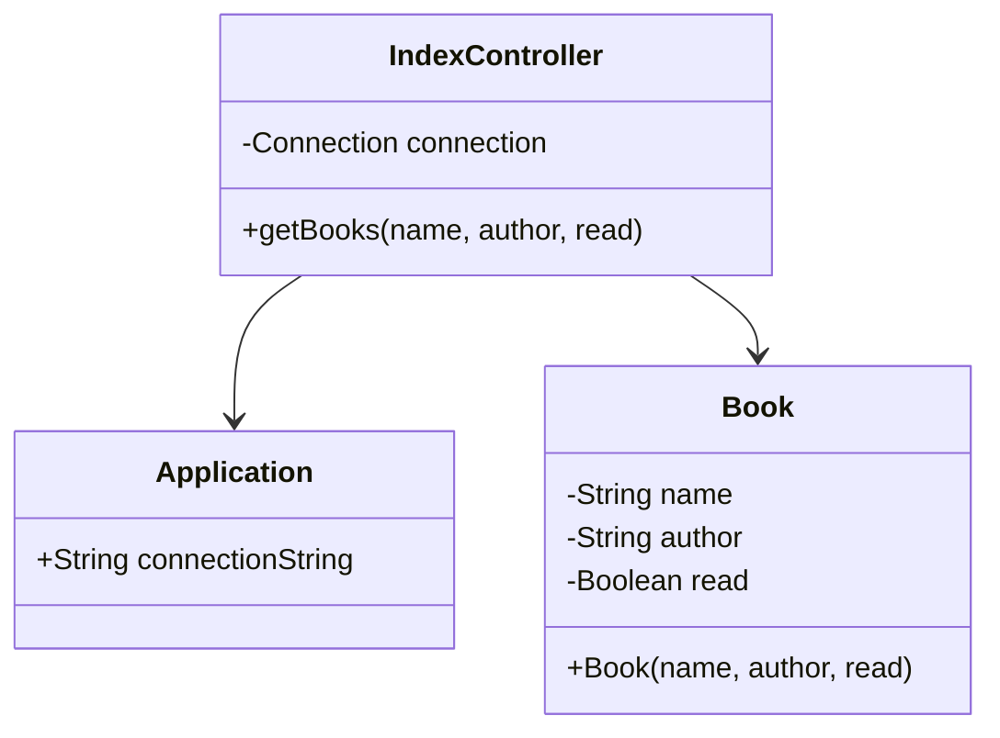

# Documentation of the file IndexController.java

## Introduction
The `IndexController.java` file is a Spring Controller class within the `com.github.hackathon.advancedsecurityjava.Controllers` package. It handles HTTP GET requests to the root URL ("/") and fetches book data from a database based on provided query parameters.

## Description
The `IndexController` class provides an endpoint that allows clients to retrieve a list of books from a database. It supports filtering books by name, author, or read status via query parameters. The class establishes a connection to the database, executes SQL queries, processes the result set, and returns the list of books as a JSON response.

## Structure
The file contains a single class, `IndexController`, which includes:

- A private static variable for database connection.
- A method `getBooks` annotated with `@GetMapping` to handle GET requests to the root URL.

## Dependencies
The file depends on several Java and Spring framework classes:

- `java.sql.Connection`
- `java.sql.DriverManager`
- `java.sql.ResultSet`
- `java.sql.SQLException`
- `java.sql.Statement`
- `java.util.ArrayList`
- `java.util.List`
- `org.springframework.stereotype.Controller`
- `org.springframework.web.bind.annotation.GetMapping`
- `org.springframework.web.bind.annotation.RequestParam`
- `org.springframework.web.bind.annotation.ResponseBody`

It also depends on the `Application` class for the database connection string and the `Book` model class for representing book data.

## Imports
```java
import java.sql.Connection;
import java.sql.DriverManager;
import java.sql.ResultSet;
import java.sql.SQLException;
import java.sql.Statement;
import java.util.ArrayList;
import java.util.List;

import com.github.hackathon.advancedsecurityjava.Application;
import com.github.hackathon.advancedsecurityjava.Models.Book;

import org.springframework.stereotype.Controller;
import org.springframework.web.bind.annotation.GetMapping;
import org.springframework.web.bind.annotation.RequestParam;
import org.springframework.web.bind.annotation.ResponseBody;
```

## Variables
- `private static Connection connection;`: A static variable to hold the database connection.

## Methods
### `getBooks`
```java
@GetMapping("/")
@ResponseBody
public List<Book> getBooks(@RequestParam(name = "name", required = false) String bookname,
    @RequestParam(name = "author", required = false) String bookauthor,
    @RequestParam(name = "read", required = false) Boolean bookread)
```
- **Purpose**: Handles GET requests to the root URL and fetches a list of books from the database based on optional query parameters (`name`, `author`, `read`).
- **Parameters**:
  - `@RequestParam(name = "name", required = false) String bookname`: Optional query parameter to filter books by name.
  - `@RequestParam(name = "author", required = false) String bookauthor`: Optional query parameter to filter books by author.
  - `@RequestParam(name = "read", required = false) Boolean bookread`: Optional query parameter to filter books by read status.
- **Returns**: A list of `Book` objects matching the query parameters.

### Method Flow
1. Initializes an empty list of `Book` objects.
2. Establishes a connection to the database using the connection string from the `Application` class.
3. Constructs an SQL query based on the provided query parameters.
4. Executes the query and processes the result set to create `Book` objects.
5. Adds the `Book` objects to the list.
6. Closes the database connection and statement.
7. Returns the list of books.

## Example
To use the `getBooks` method, send a GET request to the root URL with optional query parameters.

```
GET /?name=Harry+Potter
```

This request will return a list of books with names containing "Harry Potter".

## Dependency Diagram

```mermaid
classDiagram
    IndexController --> Application
    IndexController --> Book
    IndexController : -Connection connection
    IndexController : +getBooks(name, author, read)
    class Application {
        +String connectionString
    }
    class Book {
        -String name
        -String author
        -Boolean read
        +Book(name, author, read)
    }
```

## Notes
- The SQL queries in the `getBooks` method are vulnerable to SQL injection attacks. It is recommended to use prepared statements to prevent this vulnerability.
- Ensure that the database connection string in the `Application` class is correctly configured.

## Vulnerabilities
- **SQL Injection**: The method constructs SQL queries using string concatenation with user-provided input, making it susceptible to SQL injection attacks. To mitigate this risk, use prepared statements.