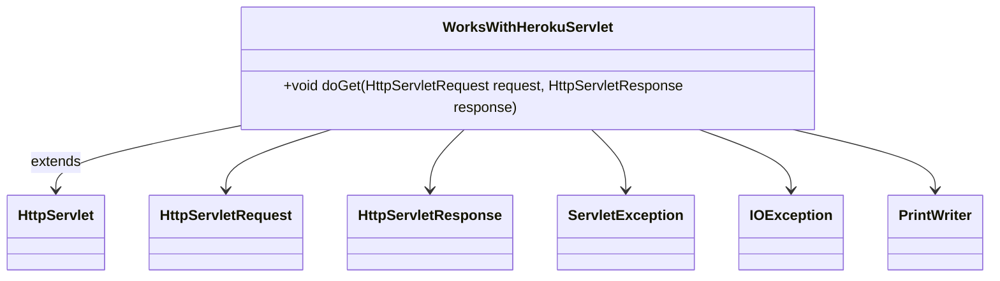

# Documentation of the file `WorksWithHerokuServlet.java`

## Introduction
This file defines a servlet named `WorksWithHerokuServlet` which extends the `HttpServlet` class. It is designed to handle HTTP GET requests and respond with a plain text message.

## Description
The `WorksWithHerokuServlet` class is a simple servlet used to respond to HTTP GET requests. When a GET request is received, the servlet responds with a status code of 404 and a plain text message "Buddy Works with Heroku".

## Structure
The file contains a single class, `WorksWithHerokuServlet`, which extends `HttpServlet` and overrides the `doGet` method to handle GET requests.

## Dependencies
This file depends on several Java EE classes for handling HTTP requests and responses:
- `javax.servlet.ServletException`
- `javax.servlet.http.HttpServlet`
- `javax.servlet.http.HttpServletRequest`
- `javax.servlet.http.HttpServletResponse`
- `java.io.IOException`
- `java.io.PrintWriter`

## Imports
```java
import javax.servlet.ServletException;
import javax.servlet.http.HttpServlet;
import javax.servlet.http.HttpServletRequest;
import javax.servlet.http.HttpServletResponse;
import java.io.IOException;
import java.io.PrintWriter;
```

## Variables
There are no explicit member variables defined in this class.

## Methods
### `doGet(HttpServletRequest request, HttpServletResponse response)`
This method is overridden to handle HTTP GET requests. It sets the content type of the response to "text/plain", sets the status to 404, and writes the message "Buddy Works with Heroku" to the response's writer.

```java
protected void doGet(HttpServletRequest request, HttpServletResponse response) throws ServletException, IOException {
    response.setContentType("text/plain");
    response.setStatus(404);
    PrintWriter writer = response.getWriter();
    writer.print("Buddy Works with Heroku");
    writer.close();
}
```

#### Parameters
- `HttpServletRequest request`: The request object that contains the client's request.
- `HttpServletResponse response`: The response object that will be sent back to the client.

#### Exceptions
- `ServletException`: If an input or output error is detected when the servlet handles the GET request.
- `IOException`: If the servlet is unable to handle the GET request.

## Example
To deploy this servlet on a web server, you would typically include it in a web application archive (WAR) and configure it in the `web.xml` file or use annotations for servlet configuration.

## Dependency Diagram


## Notes
- The status code of 404 typically indicates that the resource is not found, which might be a deliberate choice for this example.
- This servlet can be further expanded to handle other types of HTTP requests (e.g., POST, PUT, DELETE) by overriding additional methods from `HttpServlet`.

## Vulnerabilities
There are no known vulnerabilities in this file as it stands. However, it is always good to ensure that the data sent in the response does not contain sensitive information and that the servlet is properly configured in a secure web environment.