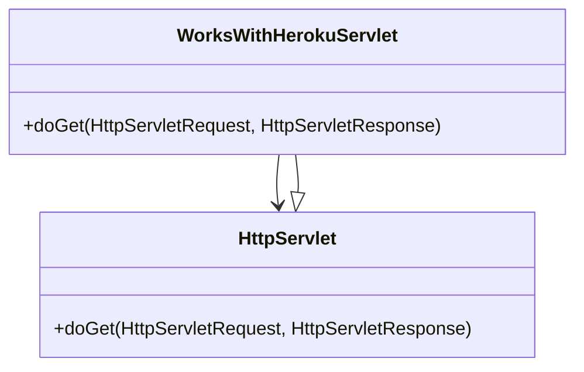

# Documentation of the file WorksWithHerokuServlet.java

## Introduction
This file contains a Java servlet named `WorksWithHerokuServlet` that handles HTTP GET requests. The purpose of this servlet is to respond to GET requests with a plain text message indicating that "Buddy Works with Heroku" and set the HTTP response status to 404.

## Description
The `WorksWithHerokuServlet` class extends the `HttpServlet` class and overrides the `doGet` method to handle HTTP GET requests. When a GET request is received, the servlet sets the response content type to "text/plain", sets the status code to 404, and writes the message "Buddy Works with Heroku" to the response output.

## Structure
The file structure includes:
- Package declaration
- Import statements
- `WorksWithHerokuServlet` class definition
  - `doGet` method

## Dependencies
The file depends on the following classes from the Java Servlet API:
- `javax.servlet.ServletException`
- `javax.servlet.http.HttpServlet`
- `javax.servlet.http.HttpServletRequest`
- `javax.servlet.http.HttpServletResponse`
- `java.io.IOException`
- `java.io.PrintWriter`

## Imports
```java
import javax.servlet.ServletException;
import javax.servlet.http.HttpServlet;
import javax.servlet.http.HttpServletRequest;
import javax.servlet.http.HttpServletResponse;
import java.io.IOException;
import java.io.PrintWriter;
```

## Variables
No class-level variables are defined in this file.

## Methods
### `doGet`
```java
protected void doGet(HttpServletRequest request, HttpServletResponse response) throws ServletException, IOException {
    response.setContentType("text/plain");
    response.setStatus(404);
    PrintWriter writer = response.getWriter();
    writer.print("Buddy Works with Heroku");
    writer.close();
}
```
- **Parameters:**
  - `HttpServletRequest request`: The request object that contains the client's request.
  - `HttpServletResponse response`: The response object used to send a response back to the client.
- **Exceptions:**
  - `ServletException`: If an input or output error occurs while handling the GET request.
  - `IOException`: If an input or output error occurs while handling the GET request.
- **Description:**
  - Sets the response content type to "text/plain".
  - Sets the response status code to 404.
  - Writes the message "Buddy Works with Heroku" to the response output.

## Example
To deploy this servlet on a server (e.g., Heroku), you need to configure the server to map GET requests to the `/WorksWithHerokuServlet` URL pattern to this servlet.

```xml
<servlet>
    <servlet-name>WorksWithHerokuServlet</servlet-name>
    <servlet-class>works.buddy.samples.WorksWithHerokuServlet</servlet-class>
</servlet>
<servlet-mapping>
    <servlet-name>WorksWithHerokuServlet</servlet-name>
    <url-pattern>/WorksWithHerokuServlet</url-pattern>
</servlet-mapping>
```

## Dependency Diagram

```mermaid
classDiagram
    WorksWithHerokuServlet --> HttpServlet
    HttpServlet <|-- WorksWithHerokuServlet
    HttpServlet: +doGet(HttpServletRequest, HttpServletResponse)
    class WorksWithHerokuServlet {
        +doGet(HttpServletRequest, HttpServletResponse)
    }
```

## Notes
- The servlet sets the status code to 404, which typically indicates that the requested resource is not found. This may be intentional to indicate that the resource represented by the message "Buddy Works with Heroku" is not actually a retrievable resource.

## Vulnerabilities
- No known vulnerabilities are present in this code. However, it is always a good practice to validate and sanitize any input received from clients to prevent security issues such as injection attacks. In this case, since the servlet does not process any input data, there are no immediate vulnerabilities.