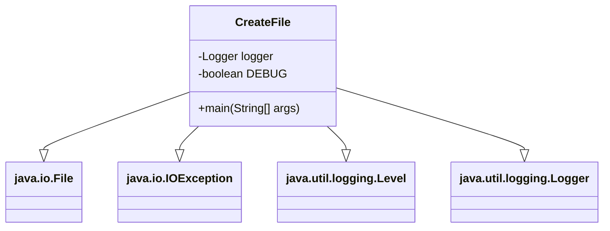

# Documentation of the file `CreateFile.java`

## Introduction

The `CreateFile.java` file is responsible for creating a new file named `filename.txt` in the current directory. If the file already exists, it logs the appropriate message. The file also includes logging capabilities to help track the file creation process.

## Description

This Java class contains a main method that attempts to create a new file named `filename.txt`. It uses the `File` class to create the file and the `Logger` class to log messages. The logging can be toggled with a `DEBUG` flag, which should be set to `false` in production to avoid verbose logging.

## Structure

The file contains:
- Package declaration
- Import statements
- Class declaration (`CreateFile`)
- Static constants for logging and debugging
- `main` method which includes the file creation logic

## Dependencies

The `CreateFile.java` file depends on the following Java classes:
- `java.io.File`
- `java.io.IOException`
- `java.util.logging.Level`
- `java.util.logging.Logger`

## Imports

```java
import java.io.File;
import java.io.IOException;
import java.util.logging.Level;
import java.util.logging.Logger;
```

## Variables

- `private static final Logger logger`: A logger instance for logging messages.
- `private static final boolean DEBUG`: A flag to toggle debug logging.

## Methods

### `public static void main(String[] args)`

The `main` method is the entry point of the application. It performs the following tasks:
1. Attempts to create a new file named `filename.txt`.
2. Logs a message if the file is successfully created and if `DEBUG` is `true`.
3. Logs a message if the file already exists and if `DEBUG` is `true`.
4. Catches and logs any `IOException` that occurs during the file creation process.

## Example

To run this file, you can compile and execute it using the following commands:

```bash
javac CreateFile.java
java CreateFile
```

## Dependency Diagram

The following diagram illustrates the dependencies in the `CreateFile.java` file:



## Notes

- Ensure that the `DEBUG` flag is set to `false` before deploying to production to avoid verbose logging.

## Vulnerabilities

There are no known vulnerabilities in this file. However, it is always a good practice to handle exceptions properly and avoid exposing sensitive information in the logs.