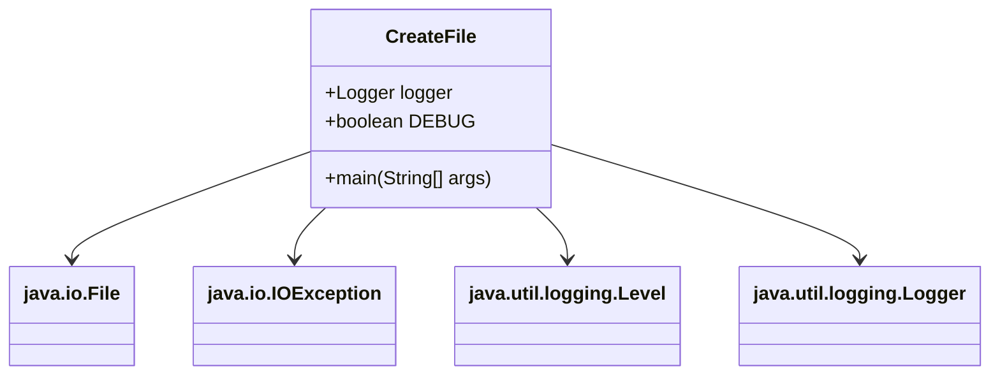

# Documentation of the file `CreateFile.java`

## Introduction

The `CreateFile.java` file contains a Java class that demonstrates how to create a new file in the filesystem. This example includes error handling and logging to track the file creation process.

## Description

The `CreateFile` class uses the `java.io.File` class to create a new file named `filename.txt`. It includes logging to provide information about the success or failure of the file creation process. The logging mechanism uses the `java.util.logging` package, and detailed log messages are controlled by a debug flag (`DEBUG`).

## Structure

The file consists of a single class `CreateFile` with a `main` method that executes the file creation logic.

## Imports

- `java.io.File`: Provides the `File` class to handle file creation.
- `java.io.IOException`: Handles input and output exceptions.
- `java.util.logging.Level`: Defines the logging levels.
- `java.util.logging.Logger`: Provides the logging capabilities.

## Variables

- `logger`: A static final variable that initializes the logger for the `CreateFile` class.
- `DEBUG`: A static final boolean flag used to enable or disable debug logging.

## Dependencies

- `java.io.File`
- `java.io.IOException`
- `java.util.logging.Level`
- `java.util.logging.Logger`

## Methods

### `public static void main(String[] args)`

The `main` method is the entry point of the application. It attempts to create a new file named `filename.txt`. If the file is successfully created, and debug mode is enabled, it logs a message indicating the file's creation. If the file already exists, it logs a different message. If an `IOException` occurs during the file creation process, it logs an error message.

```java
public static void main(String[] args) {
    try {
        File myObj = new File("filename.txt");
        if (myObj.createNewFile()) {
            if (DEBUG) {
                logger.log(Level.INFO, () -> "File created: " + myObj.getName());
            }
        } else {
            if (DEBUG) {
                logger.log(Level.INFO, "File already exists.");
            }
        }
    } catch (IOException e) {
        logger.log(Level.SEVERE, "An error occurred.", e);
    }
}
```

## Example

To run the `CreateFile` class, compile and execute it using a Java runtime environment:

```bash
javac CreateFile.java
java com.example.filecreation.CreateFile
```

Ensure that the `DEBUG` flag is appropriately set based on whether you want debug logs to be printed.

## Dependency Diagram


```mermaid
classDiagram
    class CreateFile {
        +Logger logger
        +boolean DEBUG
        +main(String[] args)
    }
    CreateFile --> java.io.File
    CreateFile --> java.io.IOException
    CreateFile --> java.util.logging.Level
    CreateFile --> java.util.logging.Logger
```

## Notes

- Make sure that the `DEBUG` flag is set to `false` in production environments to avoid unnecessary logging.
- The file name `filename.txt` is hardcoded; consider making it a parameter if you need flexibility.

## Vulnerabilities

There are no known vulnerabilities in this file. However, consider the following best practices:
- Ensure proper permissions are set for file operations to avoid security risks.
- Handle potential exceptions that may arise from file operations and logging.