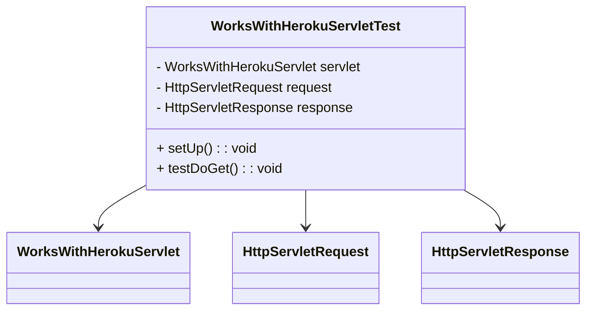

# Documentation of the file WorksWithHerokuServletTest.java

## Introduction
This file contains unit tests for the `WorksWithHerokuServlet` class using the JUnit and Mockito frameworks. The purpose of these tests is to ensure that the servlet behaves as expected when handling HTTP GET requests.

## Description
The `WorksWithHerokuServletTest` class is designed to test the `WorksWithHerokuServlet` class. It mocks `HttpServletRequest` and `HttpServletResponse` objects to simulate servlet container behavior and validate the servlet's response.

## Structure
The file consists of:
1. Class-level imports and annotations.
2. Declaration of the test class `WorksWithHerokuServletTest`.
3. Member variables for the servlet and mocks.
4. `setUp` method to initialize mocks and the servlet.
5. `testDoGet` method to test the `doGet` method of the servlet.

## Dependencies
- JUnit: For writing and running the tests.
- Mockito: For mocking the HTTP request and response objects.
- Servlet API: For `HttpServletRequest` and `HttpServletResponse`.

## Imports
```java
import org.junit.Before;
import org.junit.Test;
import org.mockito.Mock;
import org.mockito.MockitoAnnotations;

import javax.servlet.http.HttpServletRequest;
import javax.servlet.http.HttpServletResponse;
import java.io.ByteArrayOutputStream;
import java.io.PrintWriter;

import static org.junit.Assert.assertEquals;
import static org.mockito.Mockito.when;
```

## Variables
- `WorksWithHerokuServlet servlet`: The servlet instance being tested.
- `@Mock HttpServletRequest request`: Mocked HTTP request object.
- `@Mock HttpServletResponse response`: Mocked HTTP response object.

## Methods

### setUp
```java
@Before
public void setUp() throws Exception {
    MockitoAnnotations.initMocks(this);
    servlet = new WorksWithHerokuServlet();
}
```
This method is annotated with `@Before` to indicate that it should run before each test. It initializes the mocks and creates an instance of the servlet.

### testDoGet
```java
@Test
public void testDoGet() throws Exception {
    ByteArrayOutputStream out = new ByteArrayOutputStream();
    PrintWriter writer = new PrintWriter(out);
    when(response.getWriter()).thenReturn(writer);

    servlet.doGet(request, response);
    assertEquals("Buddy Works with Heroku", new String(out.toByteArray(), "UTF-8"));
}
```
This method is annotated with `@Test` to indicate that it is a test case. It:
1. Creates a `ByteArrayOutputStream` to capture the response output.
2. Sets up a mock `PrintWriter` to write to the `ByteArrayOutputStream`.
3. Configures the mock `HttpServletResponse` to return the mock `PrintWriter`.
4. Calls the `doGet` method of the servlet.
5. Asserts that the servlet's response is "Buddy Works with Heroku".

## Example
To run the test, use a JUnit-compatible test runner. The test will automatically initialize the mocks, invoke the `doGet` method on the servlet, and verify the output.

## Dependency Diagram


## Notes
- This test assumes that the `WorksWithHerokuServlet` class's `doGet` method writes "Buddy Works with Heroku" to the response.
- Make sure the servlet class is available in the classpath when running the tests.

## Vulnerabilities
No known vulnerabilities in the test code itself. However, ensure that:
- The servlet being tested is free from vulnerabilities.
- The testing frameworks (JUnit and Mockito) are up to date to avoid any security risks.