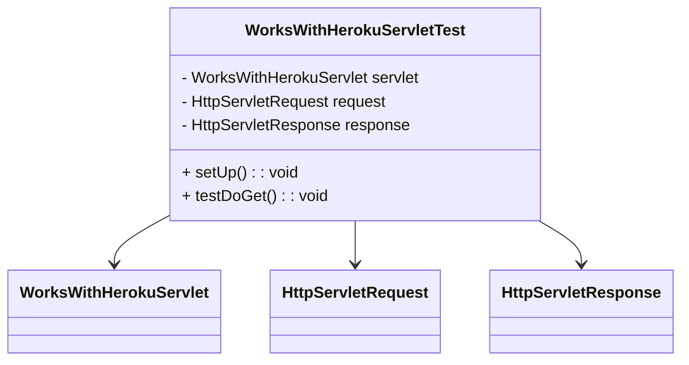

# Documentation of the file `WorksWithHerokuServletTest.java`

## Introduction
This file contains unit tests for the `WorksWithHerokuServlet` class using the JUnit framework and Mockito for mocking dependencies.

## Description
The `WorksWithHerokuServletTest` class is designed to test the functionality of the `WorksWithHerokuServlet` class. It includes setup methods to initialize the servlet and mocks for `HttpServletRequest` and `HttpServletResponse` objects. The class contains a test method to verify the `doGet` method of the servlet.

## Structure
The file consists of:
1. Imports for necessary libraries.
2. Declaration of the test class `WorksWithHerokuServletTest`.
3. Private member variables for the servlet and mocked request and response objects.
4. A `setUp` method annotated with `@Before` to initialize mocks and the servlet.
5. A `testDoGet` method annotated with `@Test` to test the `doGet` method of the servlet.

## Dependencies
The file depends on the following libraries:
- JUnit for testing.
- Mockito for mocking objects.
- Servlet API for `HttpServletRequest` and `HttpServletResponse`.

## Imports
```java
import org.junit.Before;
import org.junit.Test;
import org.mockito.Mock;
import org.mockito.MockitoAnnotations;

import javax.servlet.http.HttpServletRequest;
import javax.servlet.http.HttpServletResponse;
import java.io.ByteArrayOutputStream;
import java.io.PrintWriter;

import static org.junit.Assert.assertEquals;
import static org.mockito.Mockito.when;
```

## Variables
- `private WorksWithHerokuServlet servlet;`: An instance of the servlet to be tested.
- `@Mock private HttpServletRequest request;`: A mock of the `HttpServletRequest` object.
- `@Mock private HttpServletResponse response;`: A mock of the `HttpServletResponse` object.

## Methods
### `setUp()`
```java
@Before
public void setUp() throws Exception {
    MockitoAnnotations.initMocks(this);
    servlet = new WorksWithHerokuServlet();
}
```
This method is annotated with `@Before` and is executed before each test method. It initializes the mock objects and the servlet instance.

### `testDoGet()`
```java
@Test
public void testDoGet() throws Exception {
    ByteArrayOutputStream out = new ByteArrayOutputStream();
    PrintWriter writer = new PrintWriter(out);
    when(response.getWriter()).thenReturn(writer);

    servlet.doGet(request, response);
    assertEquals("Buddy Works with Heroku", new String(out.toByteArray(), "UTF-8"));
}
```
This method is annotated with `@Test` and tests the `doGet` method of the servlet. It sets up a `ByteArrayOutputStream` and a `PrintWriter` to capture the servlet's output. The `when` method is used to mock the behavior of the response's `getWriter` method. The test then calls the `doGet` method and asserts that the output is as expected.

## Example
Here is an example of how to run the test:
```java
public class TestRunner {
    public static void main(String[] args) {
        org.junit.runner.JUnitCore.main("works.buddy.samples.WorksWithHerokuServletTest");
    }
}
```

## Dependency Diagram

```mermaid
classDiagram
    class WorksWithHerokuServletTest {
        - WorksWithHerokuServlet servlet
        - HttpServletRequest request
        - HttpServletResponse response
        + setUp() : void
        + testDoGet() : void
    }

    WorksWithHerokuServletTest --> WorksWithHerokuServlet
    WorksWithHerokuServletTest --> HttpServletRequest
    WorksWithHerokuServletTest --> HttpServletResponse
```

## Notes
- The test class utilizes JUnit annotations for setup and test methods.
- Mockito is used to mock the servlet request and response objects, allowing for isolation of the servlet logic during testing.
- The test checks the output of the `doGet` method to ensure it matches the expected result.

## Vulnerabilities
- The code does not handle exceptions that may be thrown by the `doGet` method. Proper exception handling should be added to ensure robustness.
