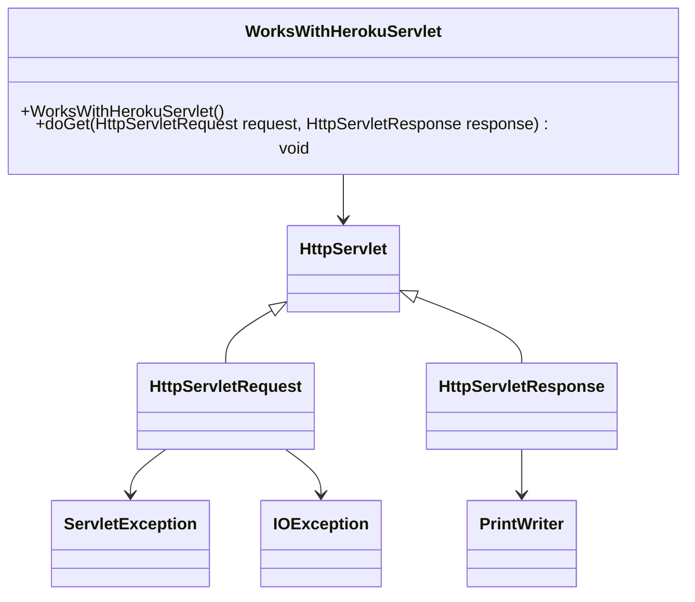

# Documentation of the file `WorksWithHerokuServlet.java`

## Introduction
This file defines a servlet class named `WorksWithHerokuServlet` that responds to HTTP GET requests. It is intended to be deployed on a Heroku server to demonstrate basic servlet functionality.

## Description
The `WorksWithHerokuServlet` class extends `HttpServlet` and overrides the `doGet` method to handle HTTP GET requests. When a GET request is received, the servlet responds with a plain text message "Buddy Works with Heroku".

## Structure
The file contains the following key components:
- A constructor for the `WorksWithHerokuServlet` class.
- An overridden `doGet` method that handles GET requests.
- Variables to manage the HTTP request and response.

## Dependencies
The file relies on the Java Servlet API, specifically:
- `javax.servlet.http.HttpServlet`
- `javax.servlet.http.HttpServletRequest`
- `javax.servlet.http.HttpServletResponse`
- `javax.servlet.ServletException`
- `java.io.IOException`
- `java.io.PrintWriter`

## Imports
The necessary imports are:
- `javax.servlet.http.HttpServlet`
- `javax.servlet.http.HttpServletRequest`
- `javax.servlet.http.HttpServletResponse`
- `javax.servlet.ServletException`
- `java.io.IOException`
- `java.io.PrintWriter`

## Variables
- `this` - Reference to the current instance of `WorksWithHerokuServlet`.
- `request` - An instance of `HttpServletRequest` representing the client's request.
- `response` - An instance of `HttpServletResponse` representing the server's response.
- `writer` - An instance of `PrintWriter` used to write the response.

## Methods

### Constructor
```java
public WorksWithHerokuServlet()
```
The constructor initializes the `WorksWithHerokuServlet` class.

### doGet
```java
protected void doGet(HttpServletRequest request, HttpServletResponse response)
        throws ServletException, IOException
```
This method handles HTTP GET requests. It sets the response content type to "text/plain", the status to HTTP 200, and writes "Buddy Works with Heroku" to the response.

## Example
To use this servlet, deploy it on a servlet container like Tomcat or Jetty, and configure it in the web application's deployment descriptor (`web.xml`). After deployment, accessing the servlet via a web browser or an HTTP client will return the message "Buddy Works with Heroku".

## Dependency Diagram


## Notes
- Ensure the servlet container is properly configured to handle servlets.
- This servlet is designed for educational purposes to demonstrate basic servlet functionality and deployment on Heroku.

## Vulnerabilities
No specific vulnerabilities are present in this basic example. However, always consider security best practices when handling HTTP requests and responses, such as input validation and proper exception handling.