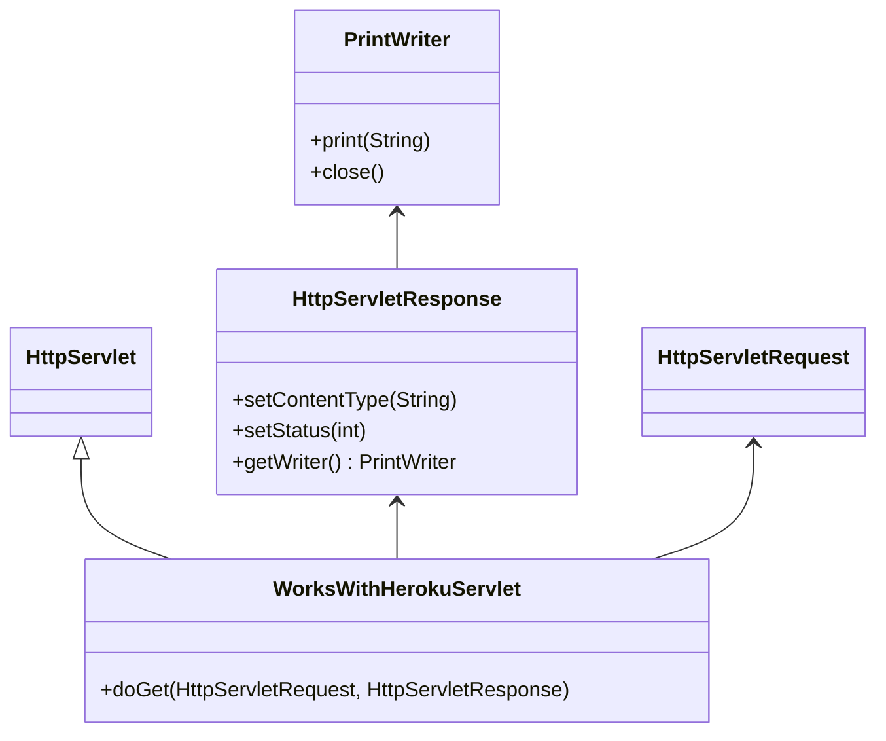

# Documentation of the file WorksWithHerokuServlet.java

## Introduction

The `WorksWithHerokuServlet.java` file contains a simple Java servlet that is designed to work with Heroku. This servlet handles HTTP GET requests by responding with a plain text message indicating that "Buddy Works with Heroku".

## Description

This servlet extends the `HttpServlet` class and overrides the `doGet` method to handle HTTP GET requests. When a GET request is received, the servlet sets the response content type to `text/plain`, sets the status to HTTP 200 (OK), and writes a message to the response indicating that "Buddy Works with Heroku".

## Structure

The file has the following structure:
- Class: `WorksWithHerokuServlet`
  - Method: `doGet`

## Dependencies

- `javax.servlet.http.HttpServlet`
- `javax.servlet.http.HttpServletRequest`
- `javax.servlet.http.HttpServletResponse`
- `javax.servlet.ServletException`
- `java.io.IOException`
- `java.io.PrintWriter`

## Imports

The file does not explicitly show imports, but it depends on the following Java packages:
```java
import javax.servlet.http.HttpServlet;
import javax.servlet.http.HttpServletRequest;
import javax.servlet.http.HttpServletResponse;
import javax.servlet.ServletException;
import java.io.IOException;
import java.io.PrintWriter;
```

## Variables

The servlet uses the following local variables:
- `HttpServletRequest request`: The request object that contains the client's request.
- `HttpServletResponse response`: The response object used to send data back to the client.
- `PrintWriter writer`: The writer used to write the response message.

## Methods

### `doGet`

```java
protected void doGet(HttpServletRequest request, HttpServletResponse response) 
    throws ServletException, IOException
```

#### Description
Handles HTTP GET requests. It sets the response content type to `text/plain`, sets the HTTP status to 200, and writes a message to the response indicating that "Buddy Works with Heroku".

#### Parameters
- `HttpServletRequest request`: The request object that contains the client's request.
- `HttpServletResponse response`: The response object used to send data back to the client.

#### Throws
- `ServletException`
- `IOException`

#### Code
```java
protected void doGet(HttpServletRequest request, HttpServletResponse response) 
    throws ServletException, IOException {
    response.setContentType("text/plain");
    response.setStatus(HttpServletResponse.SC_OK);
    PrintWriter writer = response.getWriter();
    writer.print("Buddy Works with Heroku");
    writer.close();
}
```

## Example

To deploy this servlet on Heroku, you would typically package it in a web application archive (WAR) file and deploy it using a suitable servlet container such as Tomcat.

## Dependency Diagram


```mermaid
classDiagram
    class HttpServlet {
    }
    class WorksWithHerokuServlet {
        +doGet(HttpServletRequest, HttpServletResponse)
    }
    class HttpServletRequest {
    }
    class HttpServletResponse {
        +setContentType(String)
        +setStatus(int)
        +getWriter() PrintWriter
    }
    class PrintWriter {
        +print(String)
        +close()
    }
    HttpServlet <|-- WorksWithHerokuServlet
    HttpServletResponse <-- WorksWithHerokuServlet
    HttpServletRequest <-- WorksWithHerokuServlet
    PrintWriter <-- HttpServletResponse
```

## Notes

- Ensure that the servlet container (e.g., Tomcat) is properly configured on Heroku.
- This servlet is designed to show a basic integration with Heroku and can be expanded to include more complex functionalities.

## Vulnerabilities

This simple servlet does not have any known vulnerabilities. However, always ensure to follow best practices for security, such as input validation and proper exception handling, when developing more complex servlets.