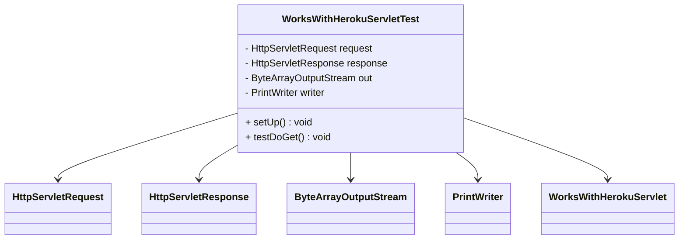

# Documentation of the file `WorksWithHerokuServletTest.java`

## Introduction

The `WorksWithHerokuServletTest.java` file is a test class for the `WorksWithHerokuServlet` servlet. It is designed to test the servlet's functionality using the JUnit and Mockito frameworks.

## Description

This file contains a test class that verifies the behavior of the `WorksWithHerokuServlet`. It uses Mockito to mock the `HttpServletRequest` and `HttpServletResponse` objects and JUnit for organizing the tests.

## Structure

The file is structured as follows:
1. Class Declaration
2. Annotations
3. Methods:
   - `setUp()`: Initializes the mocks.
   - `testDoGet()`: Tests the `doGet` method of the servlet.

## Dependencies

- JUnit
- Mockito
- Java Servlet API

## Imports

```java
import javax.servlet.http.HttpServletRequest;
import javax.servlet.http.HttpServletResponse;
import org.junit.Before;
import org.junit.Test;
import org.mockito.Mock;
import org.mockito.MockitoAnnotations;
import java.io.ByteArrayOutputStream;
import java.io.PrintWriter;
import static org.mockito.Mockito.when;
import static org.junit.Assert.assertEquals;
```

## Variables

- `request`: Mocked `HttpServletRequest` object.
- `response`: Mocked `HttpServletResponse` object.
- `out`: `ByteArrayOutputStream` to capture the servlet's output.
- `writer`: `PrintWriter` to write to the `ByteArrayOutputStream`.

## Methods

### `setUp()`

```java
@Before
public void setUp() throws Exception {
    MockitoAnnotations.initMocks(this);
}
```

This method is annotated with `@Before` and is executed before each test method. It initializes the mocks using `MockitoAnnotations.initMocks(this)`.

### `testDoGet()`

```java
@Test
public void testDoGet() throws Exception {
    ByteArrayOutputStream out = new ByteArrayOutputStream();
    PrintWriter writer = new PrintWriter(out);
    when(response.getWriter()).thenReturn(writer);

    WorksWithHerokuServlet servlet = new WorksWithHerokuServlet();
    servlet.doGet(request, response);

    writer.flush();
    String output = new String(out.toByteArray(), "UTF-8");
    assertEquals("Buddy Works with Heroku", output);
}
```

This method is annotated with `@Test` and tests the `doGet` method of the `WorksWithHerokuServlet`. It sets up the necessary mocks, calls the `doGet` method, and verifies the output.

## Example

Here is an example of how the `WorksWithHerokuServletTest` class is used to test the servlet:

```java
public class WorksWithHerokuServletTest {

    @Mock
    private HttpServletRequest request;

    @Mock
    private HttpServletResponse response;

    @Before
    public void setUp() throws Exception {
        MockitoAnnotations.initMocks(this);
    }

    @Test
    public void testDoGet() throws Exception {
        ByteArrayOutputStream out = new ByteArrayOutputStream();
        PrintWriter writer = new PrintWriter(out);
        when(response.getWriter()).thenReturn(writer);

        WorksWithHerokuServlet servlet = new WorksWithHerokuServlet();
        servlet.doGet(request, response);

        writer.flush();
        String output = new String(out.toByteArray(), "UTF-8");
        assertEquals("Buddy Works with Heroku", output);
    }
}
```

## Dependency Diagram



## Notes

- The `WorksWithHerokuServletTest` class uses annotations from JUnit (`@Before`, `@Test`) and Mockito (`@Mock`).
- The `testDoGet` method verifies that the `doGet` method of the `WorksWithHerokuServlet` returns the expected output.

## Vulnerabilities

- Ensure that the dependencies (JUnit and Mockito) are up to date to avoid any security vulnerabilities.
- Mocking frameworks, if misused, can hide bugs in the actual implementation. Ensure thorough testing with actual data where possible.