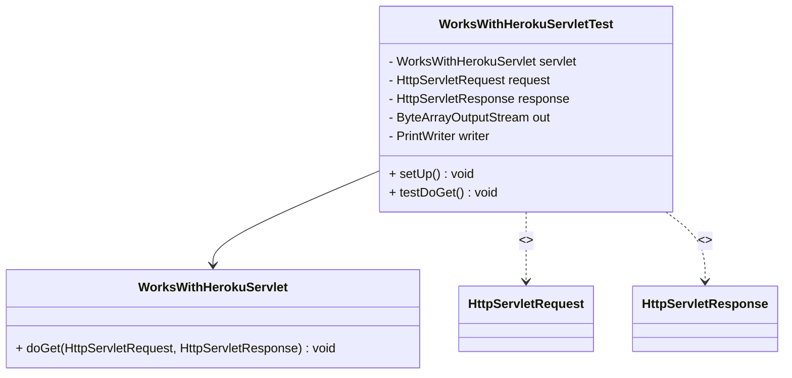

# Documentation of the file WorksWithHerokuServletTest.java

## Introduction

The `WorksWithHerokuServletTest.java` file contains a test class for testing the `WorksWithHerokuServlet`. The test class employs JUnit and Mockito to set up the testing environment and validate the servlet's behavior.

## Description

This Java file is a test class designed to test the `WorksWithHerokuServlet` functionality. It uses JUnit for structuring the test cases and Mockito for mocking dependencies. The primary focus of this test class is to ensure that the servlet behaves correctly when handling HTTP GET requests.

## Structure

The file follows a typical structure for JUnit test classes, including setup methods annotated with `@Before` and test methods annotated with `@Test`.

## Dependencies

- JUnit: Used for writing and running the tests.
- Mockito: Used for mocking objects and verifying interactions.

## Imports

```java
import javax.servlet.http.HttpServletRequest;
import javax.servlet.http.HttpServletResponse;
import org.junit.Before;
import org.junit.Test;
import org.mockito.Mock;
import org.mockito.MockitoAnnotations;
import java.io.ByteArrayOutputStream;
import java.io.PrintWriter;
import java.nio.charset.StandardCharsets;
import static org.mockito.Mockito.when;
import static org.junit.Assert.assertEquals;
```

## Variables

- `servlet`: An instance of `WorksWithHerokuServlet` which is the class under test.
- `request`: A mock of `HttpServletRequest` used to simulate HTTP requests.
- `response`: A mock of `HttpServletResponse` used to simulate HTTP responses.
- `out`: A `ByteArrayOutputStream` to capture the output written by the servlet.
- `writer`: A `PrintWriter` to write to the `ByteArrayOutputStream`.

## Methods

### `setUp()`

This method is annotated with `@Before` and is executed before each test. It initializes the mocks and the servlet instance.

```java
@Before
public void setUp() throws Exception {
    MockitoAnnotations.initMocks(this);
    servlet = new WorksWithHerokuServlet();
}
```

### `testDoGet()`

This method is annotated with `@Test` and tests the `doGet` method of the servlet. It sets up the necessary mocks, invokes the `doGet` method, and asserts the expected output.

```java
@Test
public void testDoGet() throws Exception {
    ByteArrayOutputStream out = new ByteArrayOutputStream();
    PrintWriter writer = new PrintWriter(out);

    when(response.getWriter()).thenReturn(writer);

    servlet.doGet(request, response);

    writer.flush();
    String result = new String(out.toByteArray(), StandardCharsets.UTF_8);
    assertEquals("Buddy Works with Heroku", result);
}
```

## Example

An example of how this test class can be used is shown below. This example demonstrates running the test using a JUnit test runner.

```java
public static void main(String[] args) {
    org.junit.runner.JUnitCore.main("WorksWithHerokuServletTest");
}
```

## Dependency Diagram


```mermaid
classDiagram
    class WorksWithHerokuServletTest {
        - WorksWithHerokuServlet servlet
        - HttpServletRequest request
        - HttpServletResponse response
        - ByteArrayOutputStream out
        - PrintWriter writer
        + setUp() void
        + testDoGet() void
    }
    class WorksWithHerokuServlet {
        + doGet(HttpServletRequest, HttpServletResponse) void
    }
    WorksWithHerokuServletTest --> WorksWithHerokuServlet
    WorksWithHerokuServletTest ..> HttpServletRequest : <<mock>>
    WorksWithHerokuServletTest ..> HttpServletResponse : <<mock>>
```

## Notes

- The test class uses `MockitoAnnotations.initMocks(this)` to initialize the mocks before each test.
- The `doGet` method of the servlet is tested by verifying the output written to the `HttpServletResponse`.

## Vulnerabilities

No specific vulnerabilities are identified in this test class. However, it's important to ensure that the dependencies (JUnit and Mockito) are kept up to date to avoid any potential security issues.